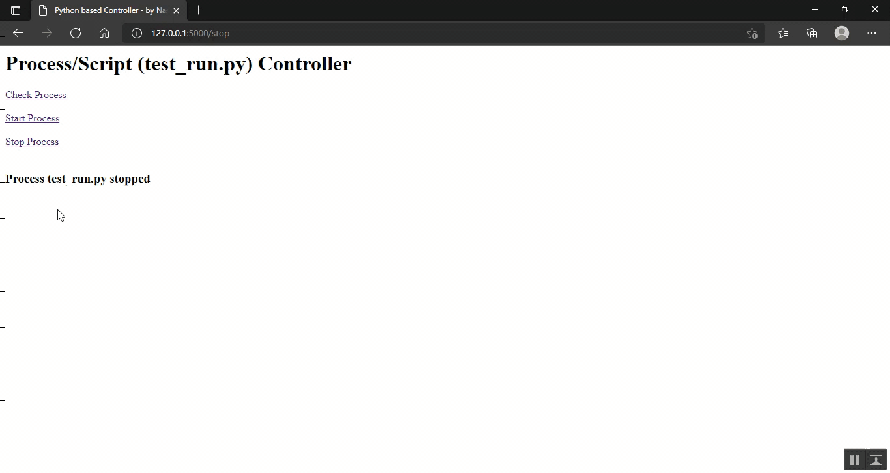

## Python-Based-Process-Executor-And-Controller

README file by Naseem Amjad

Run Python From Another Python Script (using Web)
=====================================

Introduction:
-------------
There are 2 main open source scripts developed by me called control.py and test_run.py , this is a demonstration of how you can run a python script within another script. As control.py can be accessed through web (Flask), this means you can control test_run.py script remotely using a web browser.

Making Script (control.py) ready to run:
----------------------------------------

Create Virtual Environment by issuing following command:
>> python3 -m venv ./myenv/ 

(you may need to use sudo for getting enough permission and issue above command)

Use following command to activate the Virtual Environment just created
>> source myenv/bin/activate

To install Flask, use following command.

>> sudo apt install python3-flask  

___________________________
      

Configuration of Environment:
-----------------------------

>> export FLASK_APP=control

then enter following command

>> flask run

Give following url in your web browser http://127.0.0.1:5000/check

Note: to make server accessible on net then issue following command

>> flask run --host=0.0.0.0

Now you can use http://yourIP:5000/ to access the web page.
  ___________________________

ABOUT test_run.py:
------------------

test_run.py is a sample script called from controll.py , you may click on web page to Start/Stop/Monitor test_run.py 

test_run.py shows current datetime and runs for 30 seconds approx.

______________________________

About Developer:
----------
You may contact me @ naseem[at]technologist.com for further detail / assistance.

https://www.ajsoftpk.com/naseem_amjad/
